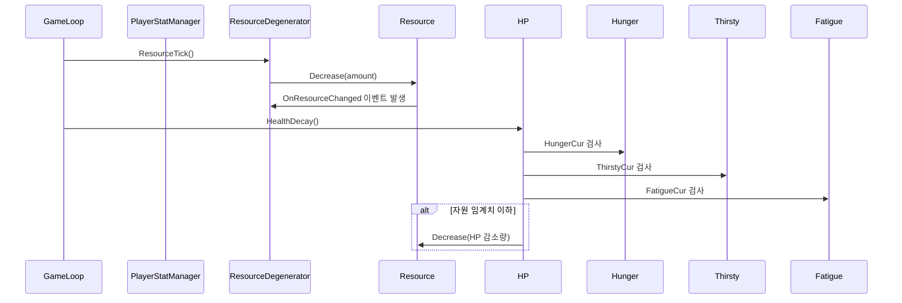
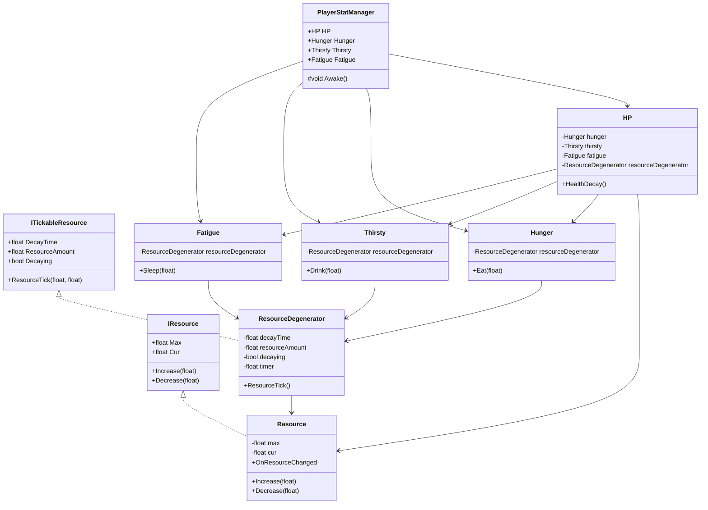

# 기능 명세서: [플레이어 자원 관리]

## 📌 기능 개요
- **기능 설명**: 게임 내 시간이 흐름에 따라 허기, 목마름, 피로 등의 자원이 자동으로 감소하는 시스템. 특정 자원 수치가 임계치 이하로 내려가면 체력에도 영향을 미침.
- **담당자**: [강소현]
- **개발 일자**: [2025-06-20]
- **관련 이슈/티켓**: N

---

## 🧩 클래스 구조 및 역할

### 1. 클래스명: Resource
- **역할**: 자원의 현재값 및 최대값을 관리하고, 증가 및 감소 로직을 처리
- **주요 메서드**:
  - Decrease(amount: float): void  
    설명: 자원을 amount만큼 감소시킴. 이벤트 발생 여부 포함.
  - Increase(amount: float): void  
    설명: 자원을 amount만큼 증가시킴. 이벤트 발생 여부 포함.
- **상속/인터페이스**:
  - 구현 인터페이스: IResource

### 2. 관련 클래스/컴포넌트
- ResourceDegenerator와 협업하여 시간이 지남에 따라 자원 감소 기능을 처리함
- HP 클래스에서 체력 감소 로직에 사용되어 자원 상태에 따른 체력 관리 지원
- Hunger, Thirsty, Fatigue 클래스에서 내부 자원 관리용으로 호출됨

### 1. 클래스명: ResourceDegenerator
- **역할**: 일정 시간마다 지정된 자원을 감소시키는 기능 담당
- **주요 메서드**:
  - ResourceTick(amount: float, decreaseTime: float): void  
    설명: decreaseTime마다 amount만큼 자원을 감소시키는 타이머 기반 메서드  
- **상속/인터페이스**:
  - 구현 인터페이스: ITickableResource

### 2. 관련 클래스/컴포넌트
- Resource와 협업하여 자원의 수치를 직접 변경함 (감소 처리)
- HP 클래스에서 호출되어 자원 상태에 따라 체력 감소를 주기적으로 실행함
- Hunger, Thirsty, Fatigue 클래스에서 공통적으로 사용되며, 시간에 따른 각각의 자원 증가를 담당함

### 1. 클래스명: HP
- **역할**: 플레이어 체력 관리 및 자원 수치에 따른 체력 감소 처리
- **주요 메서드**:
  - HealthDecay(): void
    설명:  Hunger, Thirsty, Fatigue 자원 수치가 임계치 이상일 경우 체력을 주기적으로 감소시킴 

### 2. 관련 클래스/컴포넌트
- Hunger, Thirsty, Fatigue와 협업하여 각 자원 상태를 체크함
- ResourceDegenerator를 호출하여 자원 임계치 이상일 경우 체력을 주기적으로 감소시킴
- Resource를 통해 실제 체력 수치를 조작함

### 1. 클래스명: Hunger, Thirsty, Fatigue
- **역할**: 각각 허기, 목마름, 피로 자원을 관리하고, 자원 감소 함수(Eat, Drink, Sleep) 제공
- **주요 메서드**:
  - Eat(amount: float), Drink(amount: float), Sleep(amount: float)
    설명: 각각 amount만큼 자원 감소

### 2. 관련 클래스/컴포넌트
- ResourceDegenerator와 협업하여 허기, 목마름, 피로도도 수치를 시간에 따라 증가시킴
- HP 클래스에서 호출되어 각각의의 수치가 일정 이상일 경우 체력 감소 트리거로 사용됨
- 내부적으로 Resource를 사용하여 자원 감소(Eat, Drink, Sleep) 및 현재 수치 반환

### 1. 클래스명: PlayerStatManager
- **역할**: 플레이어의 체력과 각 자원(Hunger, Thirsty, Fatigue)을 통합 관리하는 싱글톤 클래스
- **주요 메서드**:
  - HP, Hunger, Thirsty, Fatigue: 각 자원 클래스 참조
    설명: 싱글톤 패턴

### 2. 관련 클래스/컴포넌트
- 씬 전환에도 파괴되지 않도록 DontDestroyOnLoad 처리
- SingletonBehaviour<PlayerStatManager>을 상속하여 글로벌 접근 가능
---

## ⚙️ 동작 흐름 (시퀀스 다이어그램)

## 클래스 다이어그램
