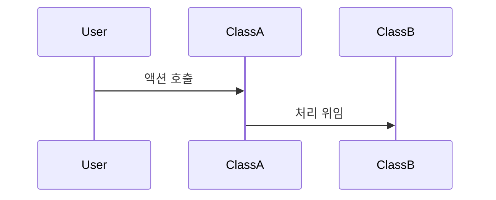
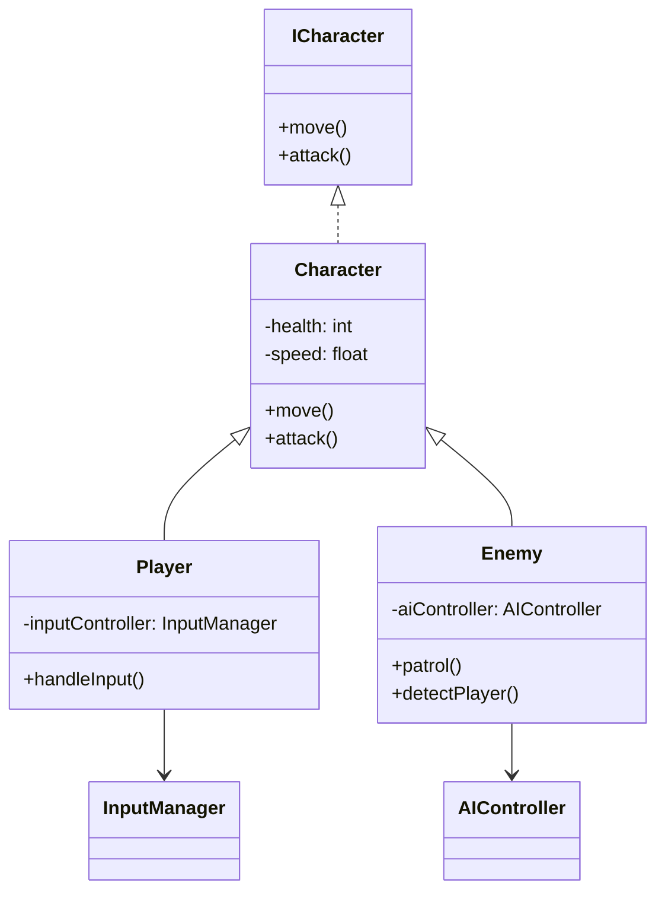

# 기능 명세서: [기능 이름]

## 📌 기능 개요
- **기능 설명**: 이 기능이 무엇을 하는지 간단하게 설명합니다.
- **담당자**: [이름]
- **개발 일자**: [YYYY-MM-DD]
- **관련 이슈/티켓**: #[이슈번호] 또는 N/A

---

## 🧩 클래스 구조 및 역할

### 1. 클래스명: `ClassName`
- **역할**: 해당 클래스의 책임과 기능
- **주요 메서드**:
  - `methodName(param: Type): ReturnType`  
    설명: 이 메서드가 어떤 동작을 하는지 서술합니다.
- **상속/인터페이스**:
  - 상속: `BaseClass`
  - 구현 인터페이스: `InterfaceName`

### 2. 관련 클래스/컴포넌트
- [ClassA]와 협업하여 XX를 처리함
- [ComponentX]에서 호출됨

---

## ⚙️ 동작 흐름 (시퀀스 다이어그램)

## 클래스 다이어그램
