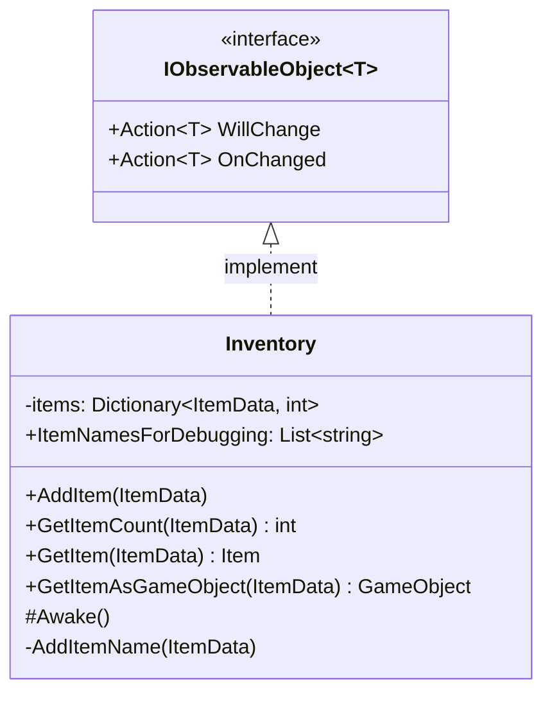

# 기능 명세서: [옵저버 패턴 class 구현](https://ko.wikipedia.org/wiki/%EC%98%B5%EC%84%9C%EB%B2%84_%ED%8C%A8%ED%84%B4)   

## 📌 기능 개요
- **기능 설명**: instance의 상태에 변경이 있을 때 외부에서 반응할 수 있게 하는 기능
- **인터페이스의 목적**
   여러가지 값이 변경 되거나 구현한 class의 다양한 값이 변경될 경우에 사용.   
   class은 value type이 아니기 때문에 간단하게 값의 변경을 감지할 수 없어 직접 관리해야 하기 때문 
- **담당자**: [신희관]
- **개발 일자**: [2025-06-20]
- **관련 이슈/티켓**:  N/A

---

## 🧩 인터페이스 구조 및 역할

### 인터페이스 명: `IObservableObject<T>`
- **역할**: 외부에서 intance의 상태 변경에 대해 반응할 수 있도록 callback function을 추가할 수 있게 하고, 변경이 있을 때 실행하는 역할
- **주요 메서드**:
  - `WillChange`: 내부의 상태가 변경되기 전에 실행 됨
  - `OnChanged`: 내부의 상태가 변경된 후에 실행 됨
- **제약**: T는 class만 가능함 (struct는[ObservableValue](https://10-team-project.github.io/docs/%EA%B8%B0%EB%8A%A5%EB%AA%85%EC%84%B8%EC%84%9C/%EB%94%94%EC%9E%90%EC%9D%B8%20%ED%8C%A8%ED%84%B4/ObservableValue/)로 구현)
### 구현 예시 [Inventory](https://10-team-project.github.io/docs/%EA%B8%B0%EB%8A%A5%EB%AA%85%EC%84%B8%EC%84%9C/%EC%95%84%EC%9D%B4%ED%85%9C/Inventory/)    
- 구현 방식   
  GetItem 또는 AddItem등으로 클래스 내부에 변경이 생길 때마다 
  값을 변경하기 전 WillChange?.Invoke(this)를 실행하고
  값이 변경된 후 OnChanged?.Invoke(this)를 실행하여 상태 변경을 알림

---

## 클래스 다이어그램
