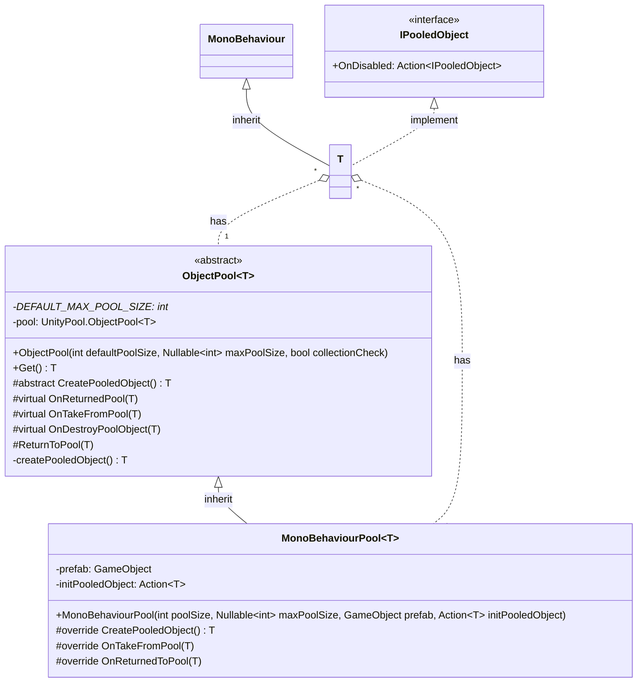

# 기능 명세서: [ObjectPool](https://10-team-project.github.io/docs/%EA%B8%B0%EB%8A%A5%EB%AA%85%EC%84%B8%EC%84%9C/%EB%94%94%EC%9E%90%EC%9D%B8%20%ED%8C%A8%ED%84%B4/ObjectPool/)을 MonoBehaviour를 대상으로 구현

## 📌 기능 개요
- **기능 설명**: MonoBehaviour를 대상으로 ObjectPool을 사용할 수 있게 하는 역할
- **담당자**: [신희관]
- **개발 일자**: [2025-06-20]
- **관련 이슈/티켓**:  N/A

---

## 🧩 클래스 구조 및 역할

### 1. 클래스명: `MonoBehaviourPool<T>`
- **역할**: MonoBehaviour를 component로 가지는 GameObject를 ObjectPool로 관리하여 사용   
		  
- **주요 메서드**   
  1 `MonoBehaviourPool`   
	    poolSize를 정하고 필요한 경우 prefab을 전달한다, 또한 GameObject를 생성 후 변경하기 위한 Action을 전달할 수 있다
  2 `CreatePooledObject`   
	    constructor에서 prefab을 제공했을 경우 prefab으로 GameObject를 생성하고 그렇지 않을 경우 새로운 GameObject를 생성한다, Action을 제공했을 경우
	  생성 후 Action을 실행한 후 Pool에 저장한다   
  3 `OnTakeFromPool`   
	  GameObject를 활성화   
  4 `OnReturnedToPool`   
	  GameObject를 비활성화   
- **제약**: T는 MonoBehaviour, IPooledObject만 가능함 

---

## 클래스 다이어그램

