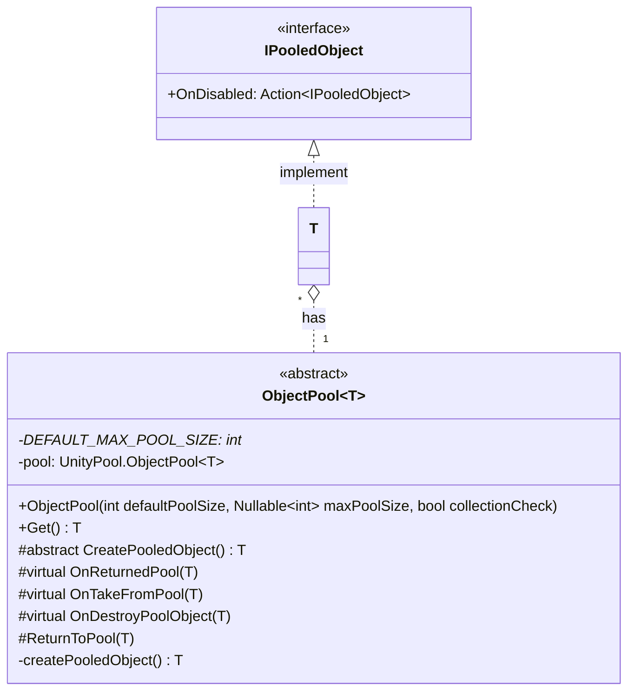

# 기능 명세서: [ObjectPool 패턴 구현](https://en.wikipedia.org/wiki/Object_pool_pattern)   

## 📌 기능 개요
- **기능 설명**: 미리 생성해 둔 동일한 class의 instance를 필요할 때 재사용하여 G.C의 영향을 줄임   
- **담당자**: [신희관]
- **개발 일자**: [2025-06-20]
- **관련 이슈/티켓**:  N/A

---

## 🧩 클래스 구조 및 역할

### 1. 인터페이스 명: `IPooledObject`
- **역할**: ObjectPool을 사용하는 대상이 구현하게 하여 사용 후 다시 반환하기 위한 역할
- **주요 메서드**:   
  - `OnDisabled`: 사용이 끝나거나 GameObject가 비활성화 될 때 직접 instance를 전달하며 실행하여 ObjectPool에 반환   
### 2. 클래스명: `ObjectPool<T>`
- **역할**: UnityPool의 [ObjectPool](https://docs.unity3d.com/6000.1/Documentation/ScriptReference/Pool.ObjectPool_1.html)을 사용하기 위한 wrapper class로 poolSize의 범위 확인과 비활성화 되었을 때 반환을 기본 동작으로 만드는 역할
- **주요 메서드**:
  - `CreatePooledObject`: pool이 생성될 때 대상 object를 생성하는 역할   
	      상속받는 class가 직접 구현해야 함
  - `ObjectPool`: UnityPool.ObjectPool을 생성할 때의 설정 값을 전달해 주는 constructor

- **제약**: T는  class, IPooledObject 가능함 

---

## 클래스 다이어그램
