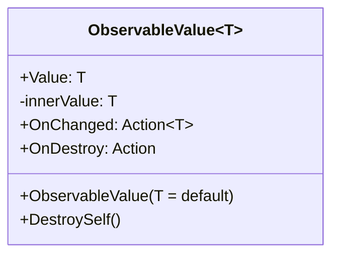

# 기능 명세서: [옵저버 패턴 구현](https://ko.wikipedia.org/wiki/%EC%98%B5%EC%84%9C%EB%B2%84_%ED%8C%A8%ED%84%B4)   

## 📌 기능 개요
- **기능 설명**: 내부에 보관되어 있는 값의 변경이 있을 때 외부에서 반응할 수 있게 하는 기능
- **담당자**: [신희관]
- **개발 일자**: [2025-06-21]
- **관련 이슈/티켓**:  N/A

---

## 🧩 클래스 구조 및 역할

### 1. 클래스명: `ObservableValue<T>`
- **역할**: 값을 저장하고 외부에서 값의 변경에 대해 반응할 수 있도록 callback function을 추가할 수 있게 하고, 변경이 있을 때 실행하는 역할
- **주요 메서드**:
  - `Value (get)`: 내부의 저장된 값을 반환 함
  - `Value (set)`: 내부의 저장된 값과 새로운 값을 비교하여 만약 다르다면 등록된 callback function들을 실행함   
	- `Action<T> OnChanged`: 값이 변경 되었을 때 실행됨
	- OnDestroy: 값을 저장하고 있는 해당 instance가 제거될 때 실행 됨
	- DestroySelf: 해당 instance를 제거해야 할 때 실행하여 등록된 callback function들을 실행함 
- **제약**: T는 struct만 가능함 (class는 [ObservableObject](https://10-team-project.github.io/docs/%EA%B8%B0%EB%8A%A5%EB%AA%85%EC%84%B8%EC%84%9C/%EB%94%94%EC%9E%90%EC%9D%B8%20%ED%8C%A8%ED%84%B4/ObservableObject/)로 구현)

---

## 클래스 다이어그램
