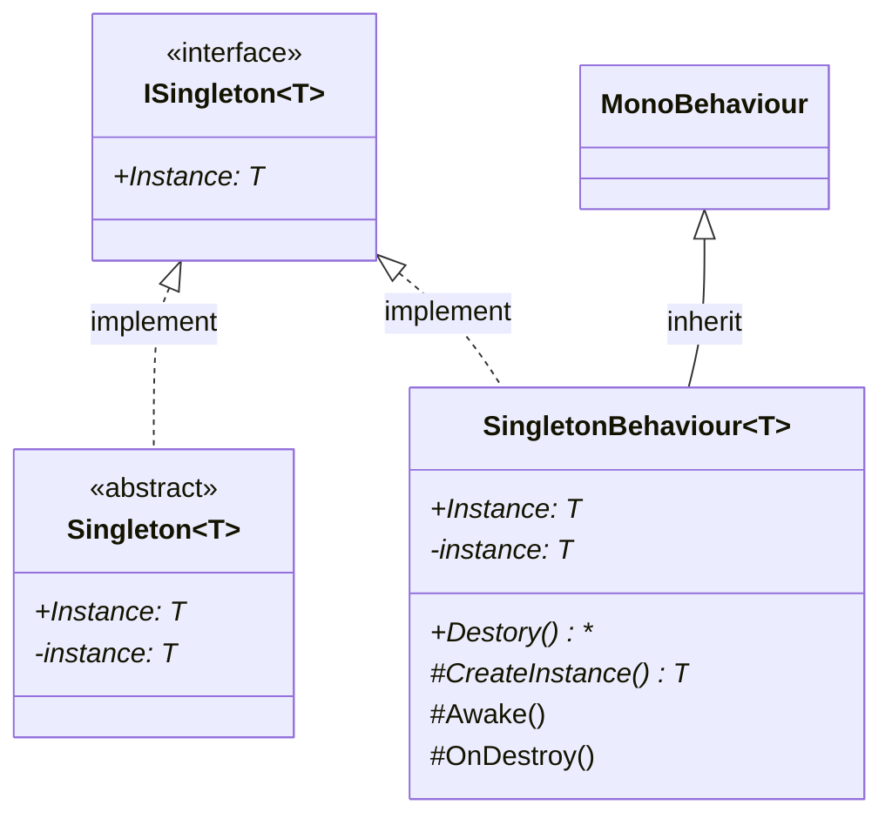

# 기능 명세서: [싱글톤 구현](https://ko.wikipedia.org/wiki/%EC%8B%B1%EA%B8%80%ED%84%B4_%ED%8C%A8%ED%84%B4)   

## 📌 기능 개요
- **기능 설명**: class의 instance가 단 하나만 존재하는 기능
- **담당자**: [신희관]
- **개발 일자**: [2025-06-20]
- **관련 이슈/티켓**:  N/A

---

## 🧩 클래스 구조 및 역할

### 1. 클래스명: `Singleton<T>`
- **역할**: class의 instance가 한 개만 존재할 수 있게 관리하는 역할   
- **주요 메서드**:
  - Instance: T   
    만약 class의 instace가 존재하면 해당 instance를, 존재하지 않는다면 새로 생성한 후 반환함   
- **상속/인터페이스**:
  - 상속: 없음
  - 구현 인터페이스: `ISingleton<T>`
- **제약**: T는 class 이고, new()로 생성할 수 있어야 함

### 2. 클래스명: `SingletoneBehaviour<T>`
- **역할**: 게임 플레이 중 GameObject에 component로서 존재하며 scene이 변경되는 것에 영향을 받지 않음
- **주요 메서드**:
  - `CreateInstace`  
			다른 SingletoneBehaviour class에 의해 생성하거나 게임이 로드 되기 전의 시점에 생성해야 할 때 사용   
  - `Awake`  
			같은 class의 instance가 존재하는지 확인하고 없다면 생성된 instance를 singleton으로 설정   
			만약 이미 존재한다면 해당 instance의 GameObject를 제거    
  - `Destroy`  
	    존재하는 instance를 제거하고 내부 instance를 null로 변경   
  - `OnDestroy`  
	    해당 GameObject가 제거될 때 singleton의 instance를 null로 변경   

- **상속/인터페이스**:
  - 상속: `MonoBehaviour`
  - 구현 인터페이스: `ISingleton<T>`
- **제약**: T가 MonoBehaviour이어야 함   

---

## 클래스 다이어그램
