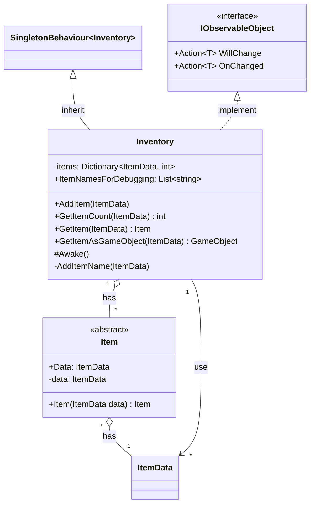

# 기능 명세서: [인벤토리 데이터]

## 📌 기능 개요
- **기능 설명**: 아이템을 보관하고 관리하는 기능
- **담당자**: [신희관]
- **개발 일자**: [2025-06-20]
- **관련 이슈/티켓**:  N/A

---

## 🧩 클래스 구조 및 역할

### 1. 클래스명: Inventory
- **역할**: 아이템을 추가하거나 보관중인 아이템을 가져올 수 있는 기능
- **주요 메서드**    
		GetItemCount: 특정한 아이템을 몇 개 가지고 있는지 확인함   
  AddItem: 하나의 아이템을 추가함    
		GetItem: 원하는 아이템을 가져옴 (보관 중이지 않을 경우 Exception)   	
		GetItemAsGameObject: 원하는 아이템의 Prefab을 사용해 GameObject를 생성해서 반환함 (Prefab이 없는 경우 Exception)    
- **상속/인터페이스**:
  - 상속   
    SingletonBehaviour\<Inventory\>: scene의 변화에 영항을 받지 않기 위해 우선 singleton으로 구현   
  - 구현 인터페이스   
    IObservableObject\<Inventory\>: 인벤토리 안의 변화를 감지할 수 있도록 하는 기능   

### 2. 관련 클래스/컴포넌트
- [ItemData](https://10-team-project.github.io/docs/%EA%B8%B0%EB%8A%A5%EB%AA%85%EC%84%B8%EC%84%9C/%EC%95%84%EC%9D%B4%ED%85%9C/ItemData/): Inventory에 아이템을 추가하거나, 보관중인 아이템을 가져오기 위해 사용됨   
- [Item](https://10-team-project.github.io/docs/%EA%B8%B0%EB%8A%A5%EB%AA%85%EC%84%B8%EC%84%9C/%EC%95%84%EC%9D%B4%ED%85%9C/Item/): Iventory에서 보관중인 아이템의 반환 형태   

---

## 클래스 다이어그램
