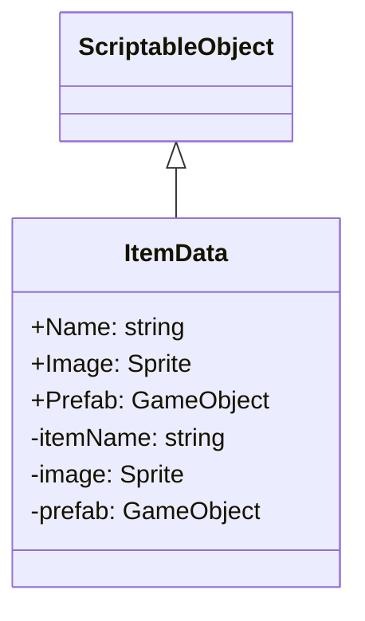

# 기능 명세서: [아이템 데이터 생성]

## 📌 기능 개요
- **기능 설명**: 아이템이 가지는 데이터를 생성해서 다른 Item 관련 클래스에 사용됩니다
- **담당자**: [신희관]
- **개발 일자**: [2025-06-21]
- **관련 이슈/티켓**: N/A

---

## 🧩 클래스 구조 및 역할

### 1. 클래스명: ItemData
- **역할**: 여러 ItemData 클래스들의 부모 역할 
- **주요 메서드**:
  - IsNameEmpty, IsImageNone, IsPrefabNone: ScriptableObject를 만들때 실수를 방지하는 기능
    설명: 클래스의 생성
- **상속/인터페이스**:
  - 상속: ScriptableObject

### 2. 관련 클래스/컴포넌트
- [Item] ItemData를 가지고 있으면서 다른 클래스와 상호작용

---

## 클래스 다이어그램
