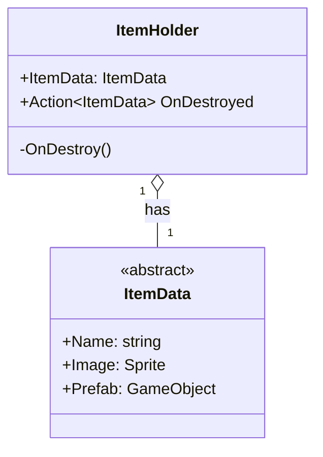

# 기능 명세서: [아이템 Component]

## 📌 기능 개요
- **기능 설명**: Scene에 있는 GameObject에 Component로 아이템을 연결하는 기능
- **담당자**: [신희관]
- **개발 일자**: [2025-06-20]
- **관련 이슈/티켓**:  N/A

---

## 🧩 클래스 구조 및 역할

### 1. 클래스명: ItemHolder
- **역할**: scene 내에서 ItemData 클래스를 가지고 있는 역할   
- **주요 메서드**   
  OnDestroy: 아이템을 가지고 있는 GameObject가 사라지는 것을 알림   	
- **상속/인터페이스**:
  - 상속: 없음
  - 구현 인터페이스: 없음   
### 2. 관련 클래스/컴포넌트
- [ItemData](https://10-team-project.github.io/docs/%EA%B8%B0%EB%8A%A5%EB%AA%85%EC%84%B8%EC%84%9C/%EC%95%84%EC%9D%B4%ED%85%9C/ItemData/)  GameObject의 Prefab을 결정하고 아이템의 정보를 가지고 있음   

---

## 클래스 다이어그램
