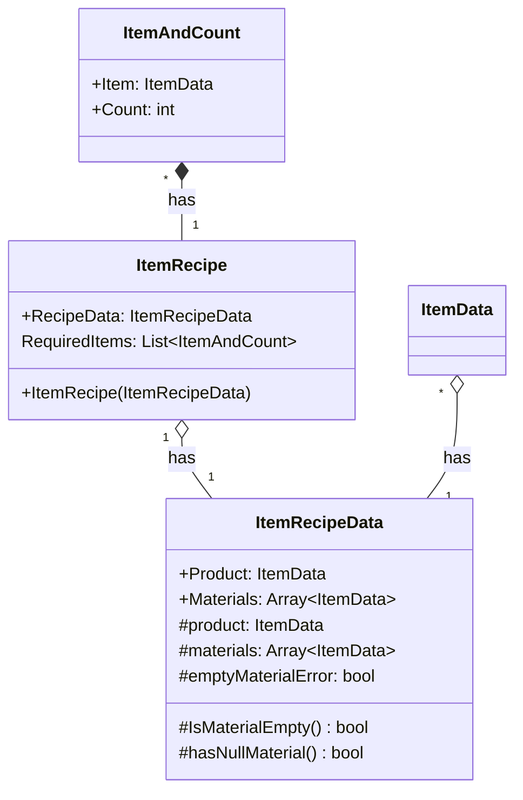

# 기능 명세서: [아이템 조합법]

## 📌 기능 개요
- **기능 설명**: 아이템을 조합하기 위한 클래스
- **담당자**: [신희관]
- **개발 일자**: [2025-06-23]
- **관련 이슈/티켓**: [#13](https://github.com/10-team-project/public/issues/13)   

---

## 🧩 클래스 구조 및 역할

### 1. 클래스명: ItemRecipe
- **역할**: 아이템을 조합하기 위해 필요한 재료와 개수를 알려주는 역할
- **주요 메서드**
  - `ItemRecipe` : ItemRecipeData를 필요로 하는 constructor
- **상속/인터페이스**:
  - 상속: UnityEngine.Object
### 2. 관련 클래스/컴포넌트
- [ItemRecipeData](https://10-team-project.github.io/docs/%EA%B8%B0%EB%8A%A5%EB%AA%85%EC%84%B8%EC%84%9C/%EC%95%84%EC%9D%B4%ED%85%9C/ItemRecipeData/) 조합법의 데이터를 가지고 있는 ScriptableObject

## 클래스 다이어그램
