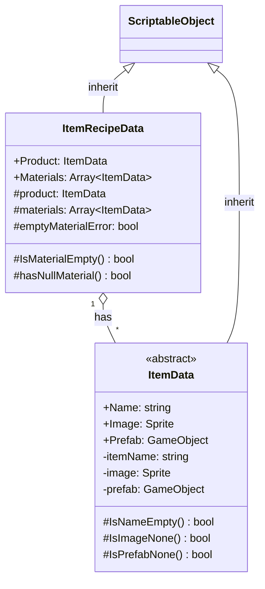

# 기능 명세서: [아이템 조합법 데이터]

## 📌 기능 개요
- **기능 설명**: 아이템을 조합하기 위한 데이터 
- **담당자**: [신희관]
- **개발 일자**: [2025-06-23]
- **관련 이슈/티켓**: N/A

---

## 🧩 클래스 구조 및 역할

### 1. 클래스명: ItemRecipeData
- **역할**: 1개 이상의 아이템을 조합해 새로운 아이템을 생성하는 방법을 정의합니다
- **주요 메서드**
  - `IsMaterialEmpty`, `hasNullMaterial`: 에디터에서 작업할 때 오류를 방지
- **상속/인터페이스**:
  - 상속: ScriptableObject

### 2. 관련 클래스/컴포넌트
- [ItemData](https://10-team-project.github.io/docs/%EA%B8%B0%EB%8A%A5%EB%AA%85%EC%84%B8%EC%84%9C/%EC%95%84%EC%9D%B4%ED%85%9C/ItemData/) 조합법의 재료가 되고 생성한 결과물이 되는 클래스

## 클래스 다이어그램
