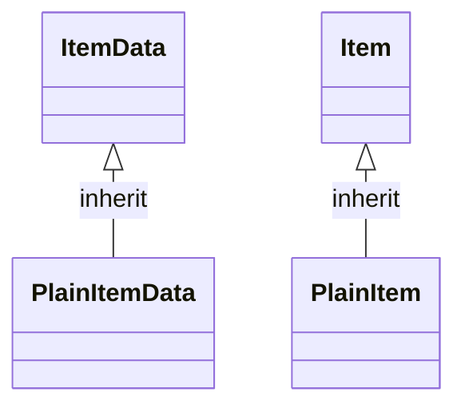

# 기능 명세서: [일반 아이템]

## 📌 기능 개요
- **기능 설명**: 특별한 기능이 없는 아이템
- **담당자**: [신희관]
- **개발 일자**: [2025-06-23]
- **관련 이슈/티켓**:  N/A

---

## 🧩 클래스 구조 및 역할

### 1. 클래스명: PlainItemData
- **역할**: ItemData 클래스를 상속하는 클래스 중 추가 기능이 없는 concrete class
- **주요 메서드**: 없음	
- **상속/인터페이스**:
  - 상속: [ItemData](https://10-team-project.github.io/docs/%EA%B8%B0%EB%8A%A5%EB%AA%85%EC%84%B8%EC%84%9C/%EC%95%84%EC%9D%B4%ED%85%9C/ItemData/)  
### 2. 클래스명: PlainItem
- **역할**: PlainItemData로 생성되는 아이템, Item을 상속하는 클래스 중 추가 기능이 없는 concrete class
- **주요 메서드**: 없음	
- **상속/인터페이스**:
  - 상속: [Item](https://10-team-project.github.io/docs/%EA%B8%B0%EB%8A%A5%EB%AA%85%EC%84%B8%EC%84%9C/%EC%95%84%EC%9D%B4%ED%85%9C/Item/)  

### 2. 관련 클래스/컴포넌트
- [Inventory](https://10-team-project.github.io/docs/%EA%B8%B0%EB%8A%A5%EB%AA%85%EC%84%B8%EC%84%9C/%EC%95%84%EC%9D%B4%ED%85%9C/Invetory/)에서 사용됨
- [ItemRecipe](https://10-team-project.github.io/docs/%EA%B8%B0%EB%8A%A5%EB%AA%85%EC%84%B8%EC%84%9C/%EC%95%84%EC%9D%B4%ED%85%9C/ItemRecipe/) 와 [ItemRecipeData](https://10-team-project.github.io/docs/%EA%B8%B0%EB%8A%A5%EB%AA%85%EC%84%B8%EC%84%9C/%EC%95%84%EC%9D%B4%ED%85%9C/ItemRecipeData/)에서 사용됨

---

## 클래스 다이어그램
