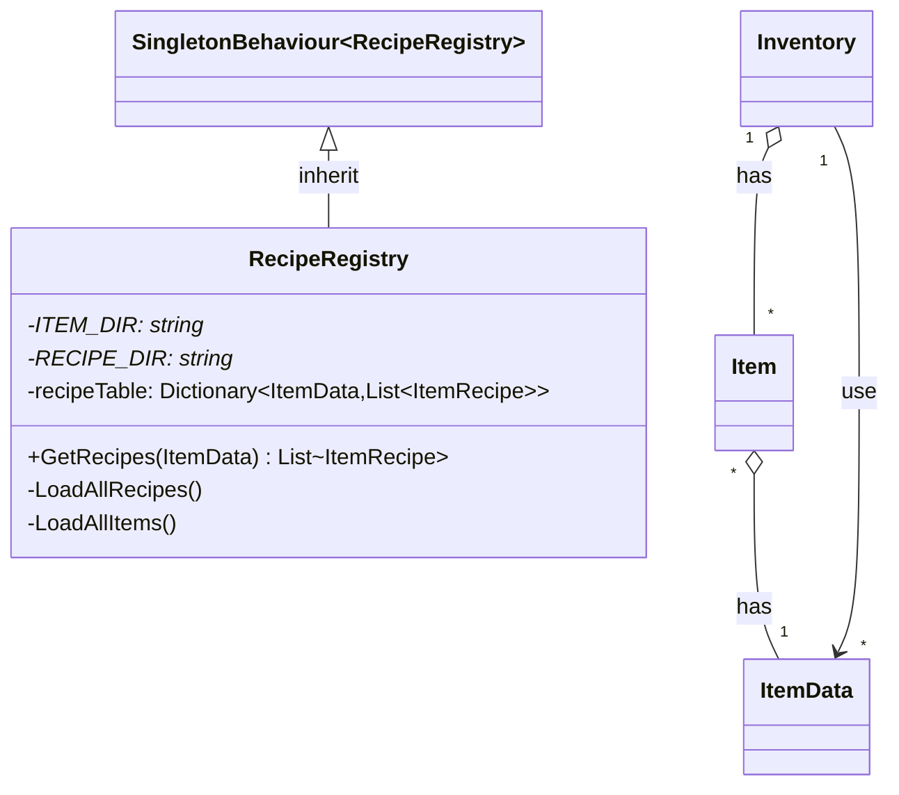

# 기능 명세서: [조합법 보관]

## 📌 기능 개요
- **기능 설명**: 아이템을 조합하는 조합법을 보관하고 관리하는 기능
- **담당자**: [신희관]
- **개발 일자**: [2025-06-23]
- **관련 이슈/티켓**:  N/A

---

## 🧩 클래스 구조 및 역할

### 1. 클래스명: RecipeRegistry
- **역할**: 아이템 조합법을 데이터로부터 로드하고 보관, 가져올 수 있는 기능
- **주요 메서드**    
		`GetRecipes`: 특정한 아이템을 조합하기 위한 조합법의 리스트를 반환
		`LoadAllItems`: 정해진 폴더 위치에 저장된 ItemData들을 로드해 조합할 대상을 정함
		`LoadAllRecipes`: 정해진 폴더 위치에 저장된 ItemRecipeData들을 이용해 조합법을 로드
- **상속/인터페이스**:
  - 상속   
    SingletonBehaviour<Inventory\>: scene의 변화에 영항을 받지 않기 위해 우선 singleton으로 구현   
  - 구현 인터페이스 : 없음
### 2. 관련 클래스/컴포넌트
- [ItemData](https://10-team-project.github.io/docs/%EA%B8%B0%EB%8A%A5%EB%AA%85%EC%84%B8%EC%84%9C/%EC%95%84%EC%9D%B4%ED%85%9C/ItemData/): 조합법에 의해 생성되는 클래스로 원하는 ItemData으로 조합법을 찾을 수 있음
- [ItemRecipe](https://10-team-project.github.io/docs/%EA%B8%B0%EB%8A%A5%EB%AA%85%EC%84%B8%EC%84%9C/%EC%95%84%EC%9D%B4%ED%85%9C/ItemRecipe/): RecipeReigstry에서 보관중인 데이터

---

## 클래스 다이어그램
