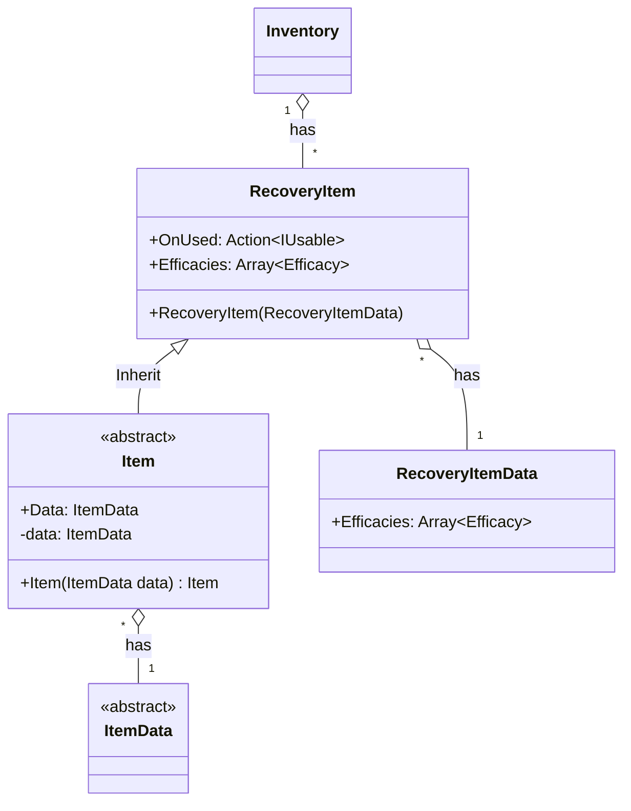

# 기능 명세서: [회복용 아이템]

## 📌 기능 개요
- **기능 설명**: 플레이어의 자원을 회복시킬 수 있는 아이템
- **담당자**: [신희관]
- **개발 일자**: [2025-06-20]
- **관련 이슈/티켓**:  N/A

---

## 🧩 클래스 구조 및 역할

### 1. 클래스명: RecoveryItem
- **역할**: [RecoveryItemData](https://10-team-project.github.io/docs/%EA%B8%B0%EB%8A%A5%EB%AA%85%EC%84%B8%EC%84%9C/%EC%95%84%EC%9D%B4%ED%85%9C/RecoveryItemData/) 클래스를 가지고 있고 플레이어의 자원을 회복하는데 사용 됨   
- **주요 메서드**
		Recovery: 아이템이 사용되고 회복시킬 수 있는 항목과 자원들의 수치를 반환 함
- **상속/인터페이스**:
  - 상속: [Item](https://10-team-project.github.io/docs/%EA%B8%B0%EB%8A%A5%EB%AA%85%EC%84%B8%EC%84%9C/%EC%95%84%EC%9D%B4%ED%85%9C/Item/)   
  - 구현 인터페이스   
    IUsable: 아이템이 사용되는 것을 외부에서 감지할 수 있음   
    IRecoveryable: 플레이어의 자원을 회복시킬 수 있는 것을 나타냄   
### 2. 관련 클래스/컴포넌트
- [Inventory](https://10-team-project.github.io/docs/%EA%B8%B0%EB%8A%A5%EB%AA%85%EC%84%B8%EC%84%9C/%EC%95%84%EC%9D%B4%ED%85%9C/Invetory/)에서 사용됨   
- Character 또는 Player와 상호작용 할 예정  

---

## 클래스 다이어그램
