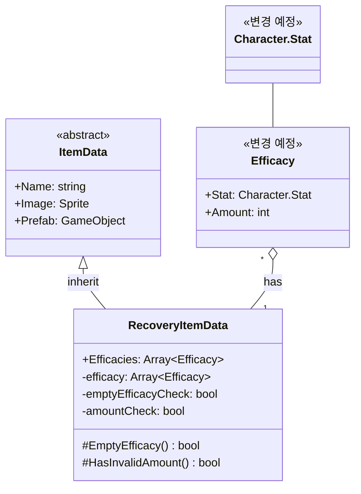

# 기능 명세서: [회복용 아이템 데이터]

## 📌 기능 개요
- **기능 설명**: 플레이어의 자원을 회복시킬 수 있는 아이템의 데이터를 생성합니다
- **담당자**: [신희관]
- **개발 일자**: [2025-06-20]
- **관련 이슈/티켓**:  N/A

---

## 🧩 클래스 구조 및 역할

### 1. 클래스명: RecoveryItemData
- **역할**: 회복용 아이템의 데이터를 에디터에서 ScriptableObject로 만들 수 있게 합니다   
- **주요 메서드** 
  EmptyEfficacy, HasInvaildAmount: 에디터에서 생성할 때 오류를 방지하는 기능 (amountCheck, emptyEfficacyCheck도 에디터를 위한 값)   
  
- **상속/인터페이스**:
  - 상속: [ItemData](https://10-team-project.github.io/docs/%EA%B8%B0%EB%8A%A5%EB%AA%85%EC%84%B8%EC%84%9C/%EC%95%84%EC%9D%B4%ED%85%9C/ItemData/)   
  - 구현 인터페이스: 없음

### 2. 관련 클래스/컴포넌트
- [Inventory](https://10-team-project.github.io/docs/%EA%B8%B0%EB%8A%A5%EB%AA%85%EC%84%B8%EC%84%9C/%EC%95%84%EC%9D%B4%ED%85%9C/Invetory/)에서 사용됨   
- 임시로 만든 Character의 Stat으로 어떤 자원을 회복할지 결정함   
`- Character 또는 Player와 상호작용 할 예정   

---

## 클래스 다이어그램
